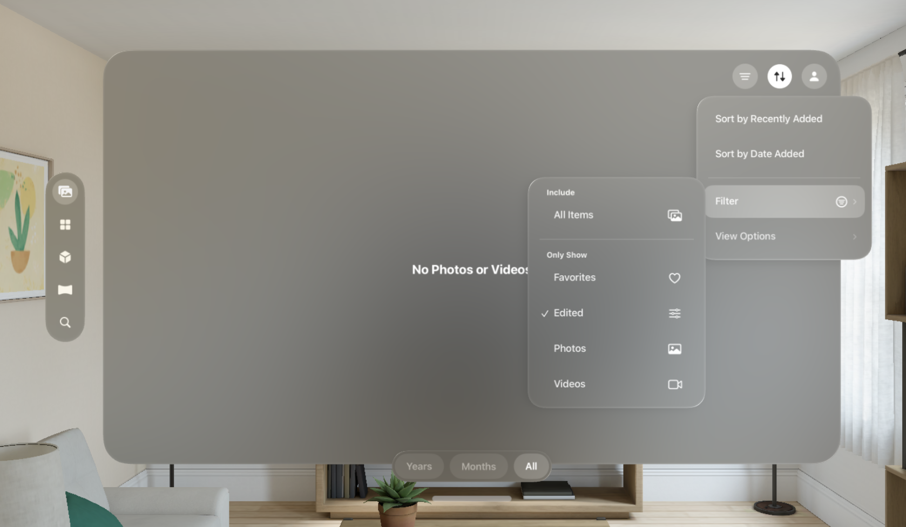

# Photos-visionOS
A **work-in-progress** SwiftUI recreation of the visionOS **2 beta** Photos app.

## Preview

> [!IMPORTANT]
>
> This project is being worked on using **Xcode 16 beta** with new APIs for visionOS 2.0+.
> It cannot be used on older versions.
>

## Information
- This personal project is a recreation of Apple's Photos app for visionOS 2 **beta**.
- Features such as accessing and viewing photos are not implemented yet.

## Usage
Open the project in Xcode 16 beta and run with either a Simulator instance or a physical device with Developer Mode enabled as a destination on visionOS 2 beta.

As this is a personal project for learning Swift and SwiftUI, feel free to download and modify the project for your own personal purposes.

## Disclaimers
- All assets such as icons and images are not my own in any way.
- This app is a recreation of Apple's own apps and designs for learning purposes only.
- Feel free to look through the commit history to see the project evolve from a single view to its current state.

## Other Projects
- **visionOS Settings** https://github.com/zhrispineda/Settings-visionOS
- **iOS & iPadOS Settings** https://github.com/zhrispineda/Settings-iOS
- **watchOS Settings** https://github.com/zhrispineda/Settings-watchOS
